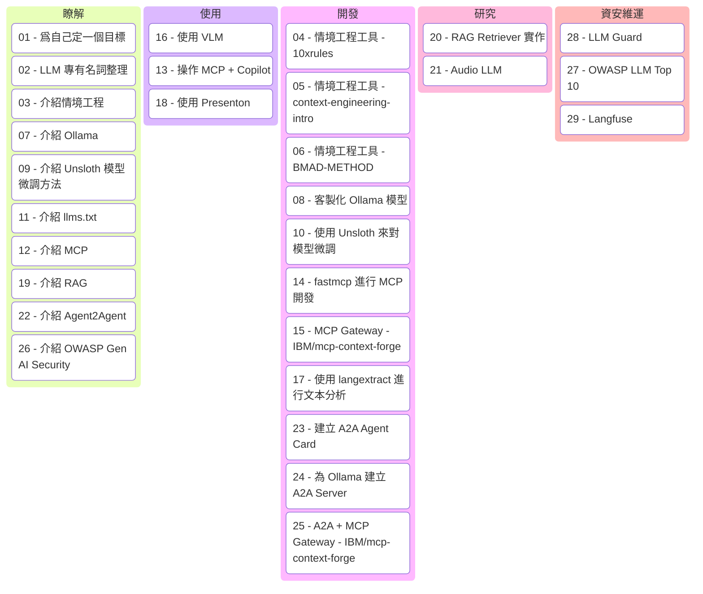

## 發文分類

筆者在過去 29 天的挑戰中，嘗試了許多不同的題目，這些題目可以大致分成以下幾個類別：

1. **瞭解**：介紹 LLM 相關的基本概念和工具，像是 Context Engineering、想在地端跑 LLM 的 Ollama、模型微調方法論、MCP 工具、LLM 資安議題
2. **使用**：實際操作一些現有的工具和模型，像是 VLM（視覺語言模型）、讓 LLM 可以使用 MCP 工具、自動產生簡報的 Presenton
3. **開發**：嘗試自己動手做一些專案，像是情境工程工具、客製化 Ollama 模型、嘗試使用 Unsloth 來對模型微調、MCP Gateway、文本分析工具、A2A 開發
4. **研究**：認真研就一些技術背後的運作邏輯，像是 RAG Retriever、Higgs-Audio（語音大模型）
5. **資安維運**：關注 LLM 在資安方面的風險和防護，像是 OWASP LLM Top 10、LLM Guard

### 快速復盤

最後不免俗的來個復盤，回顧一下這 30 天的挑戰有沒有哪個地方收穫最多以及看起來還需要加強的地方。

#### 做得好的題目

- **26 - 介紹 OWASP Gen AI Security**：本來就一直很想碰 AI 資安相關的議題，藉由這次的挑戰，才有一個動力去認真研究 OWASP Gen AI Security 的內容
- **27 - OWASP LLM Top 10**：更深入了解 LLM 在資安方面的風險，以及如何防範常見的攻擊手法
- **28 - LLM Guard**：實際去操作 LLM Guard，意外發現裡面使用到很多 NLP 分類的模型，在 GenAI 當道的時代，還可以看到分類的模型還是很有趣的（懷舊）

#### 做得不好的題目

- **10 - 實際使用 Unsloth 來對模型微調**：基本上就是按照官方文件操作，裡面模組的原理並沒有深入研究，效果也不好
- **16 - 使用 VLM**：單純操作官方的網頁，後續看到 IBM 的 Granite 模型效果好很多，可惜當初選錯模型

#### 好可惜的題目

- **情境工程系列**：只能說世界走得太快，幾乎是每幾天就有新的工具出現，像是 Github 的 spec-kit、kiro 等等，各種 BDD、SDD、TDD 工具如雪片般飛來 ...
  - 04 - 情境工程工具 - 10xrules
  - 05 - 情境工程工具 - context-engineering-intro
  - 06 - 情境工程工具 - BMAD-METHOD

## 心得

這 30 天的挑戰是以「廣」爲目的，幾乎把所有有關 LLM 的議題都碰過一遍（大概），也因爲每天只有一篇文章的關係，所以並不會很深入的去研究裡面的細節，這部分是比較可惜的地方