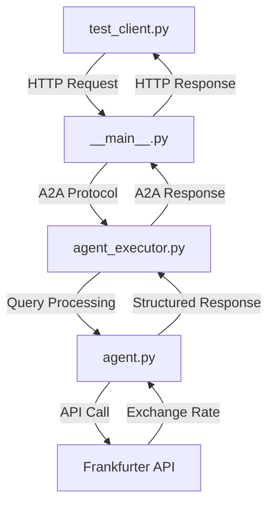

# LangGraph Currency Agent - 程式檔案說明

本文件詳細說明 `app/` 目錄中所有 Python 檔案的用途和功能。

## 📁 檔案結構概覽

```
app/
├── __init__.py          # Python 套件初始化檔案 (空檔案)
├── __main__.py          # 主程式進入點，啟動 A2A 伺服器
├── agent.py             # 核心 AI 代理邏輯和貨幣轉換功能
├── agent_executor.py    # A2A 協議執行器，處理請求和回應
└── test_client.py       # 測試客戶端，用於測試 A2A 伺服器功能
```

---

## 📄 檔案詳細說明

### 1. `__init__.py`
- **用途**: Python 套件初始化檔案
- **內容**: 空檔案，讓 `app` 目錄成為 Python 套件
- **功能**: 使其他模組可以透過 `from app import ...` 匯入

### 2. `__main__.py` 🚀
**主程式進入點 - A2A 伺服器啟動器**

#### 主要功能:
- **伺服器啟動**: 使用 `uvicorn` 啟動 A2A 協議伺服器
- **環境設定檢查**: 驗證必要的環境變數 (API 金鑰、模型設定)
- **命令列參數**: 支援 `--host` 和 `--port` 參數
- **Agent Card 設定**: 定義代理的能力、技能和描述

#### 關鍵組件:
```python
# CLI 命令設定
@click.command()
@click.option('--host', 'host', default='localhost')
@click.option('--port', 'port', default=10000)

# 環境檢查
if os.getenv('model_source', 'google') == 'google':
    # 檢查 Google Gemini API 金鑰
else:
    # 檢查本地 LLM 設定 (Ollama)

# A2A 伺服器建立
server = A2AStarletteApplication(
    agent_card=agent_card, 
    http_handler=request_handler
)
```

#### 執行方式:
```bash
uv run app                    # 預設 localhost:10000
uv run app --host 0.0.0.0 --port 8080  # 自訂 host/port
```

### 3. `agent.py` 🤖
**核心 AI 代理 - 貨幣轉換智慧助手**

#### 主要功能:
- **LangGraph ReAct Agent**: 使用推理-行動模式的 AI 代理
- **貨幣轉換工具**: 整合 Frankfurter API 獲取即時匯率
- **多模型支援**: 支援 Google Gemini 和本地 LLM (Ollama)
- **結構化回應**: 使用 Pydantic 模型定義回應格式

#### 核心組件:

**1. 貨幣轉換工具**:
```python
@tool
def get_exchange_rate(currency_from, currency_to, currency_date):
    """取得貨幣匯率的工具函數"""
    # 呼叫 Frankfurter API
    response = httpx.get(f'https://api.frankfurter.app/{currency_date}')
```

**2. 回應格式定義**:
```python
class ResponseFormat(BaseModel):
    status: Literal['input_required', 'completed', 'error']
    message: str
```

**3. AI 模型初始化**:
```python
def __init__(self):
    model_source = os.getenv('model_source', 'google')
    if model_source == 'google':
        self.model = ChatGoogleGenerativeAI(model='gemini-2.0-flash')
    else:
        self.model = ChatOpenAI(...)  # 本地 LLM
```

**4. 串流處理**:
```python
async def stream(self, query, context_id):
    """提供即時串流回應"""
    # 處理工具呼叫和回應狀態
```

#### 特色功能:
- **智慧對話**: 可要求使用者提供更多資訊
- **專業限制**: 只處理貨幣相關查詢
- **記憶功能**: 使用 MemorySaver 維持對話狀態
- **即時回饋**: 提供處理進度更新

### 4. `agent_executor.py` ⚙️
**A2A 協議執行器 - 請求處理中介層**

#### 主要功能:
- **協議轉換**: 將 A2A 協議請求轉換為代理可理解的格式
- **任務管理**: 處理任務狀態和生命週期
- **事件處理**: 管理事件佇列和狀態更新
- **錯誤處理**: 統一的錯誤處理和回應

#### 核心流程:
```python
async def execute(self, context, event_queue):
    # 1. 驗證請求
    error = self._validate_request(context)
    
    # 2. 取得使用者輸入
    query = context.get_user_input()
    
    # 3. 建立或取得任務
    task = context.current_task or new_task(context.message)
    
    # 4. 串流處理代理回應
    async for item in self.agent.stream(query, task.context_id):
        # 根據狀態更新任務
        if not is_task_complete and not require_user_input:
            await updater.update_status(TaskState.working, ...)
        elif require_user_input:
            await updater.update_status(TaskState.input_required, ...)
        else:
            await updater.complete()
```

#### 狀態管理:
- **working**: 代理正在處理請求
- **input_required**: 需要使用者提供更多資訊
- **completed**: 任務完成
- **error**: 處理過程中發生錯誤

### 5. `test_client.py` 🧪
**測試客戶端 - A2A 協議測試工具**

#### 主要功能:
- **Agent Card 獲取**: 測試公開和擴充代理卡片
- **同步訊息**: 測試基本的請求-回應功能
- **多輪對話**: 測試對話記憶和上下文保持
- **串流訊息**: 測試即時串流回應

#### 測試案例:

**1. Agent Card 解析**:
```python
# 獲取公開代理卡片
resolver = A2ACardResolver(httpx_client, base_url)
public_card = await resolver.get_agent_card()

# 嘗試獲取擴充代理卡片 (需認證)
extended_card = await resolver.get_agent_card(
    relative_card_path=EXTENDED_AGENT_CARD_PATH,
    http_kwargs={'headers': auth_headers_dict}
)
```

**2. 基本查詢測試**:
```python
send_message_payload = {
    'message': {
        'role': 'user',
        'parts': [{'kind': 'text', 'text': 'how much is 10 USD in INR?'}],
        'message_id': uuid4().hex,
    },
}
```

**3. 多輪對話測試**:
```python
# 第一輪: 不完整的查詢
'How much is the exchange rate for 1 USD?'
# 第二輪: 提供缺失資訊
'CAD'
```

**4. 串流回應測試**:
```python
stream_response = client.send_message_streaming(streaming_request)
async for chunk in stream_response:
    print(chunk.model_dump(mode='json', exclude_none=True))
```

#### 執行方式:
```bash
uv run app/test_client.py
```

---

## 🔄 系統運作流程



## 🛠️ 技術特點

1. **模組化設計**: 每個檔案負責特定功能，易於維護
2. **協議遵循**: 完全符合 A2A 協議規範
3. **多模型支援**: 靈活的 LLM 後端選擇
4. **即時互動**: 支援串流和推送通知
5. **錯誤處理**: 完善的錯誤處理機制
6. **測試覆蓋**: 完整的功能測試客戶端

## 🚀 快速開始

1. **啟動伺服器**: `uv run app`
2. **執行測試**: `uv run app/test_client.py`
3. **發送請求**: 使用 curl 或其他 HTTP 客戶端

這個架構展示了如何使用 LangGraph 和 A2A 協議建立一個功能完整的 AI 代理服務。