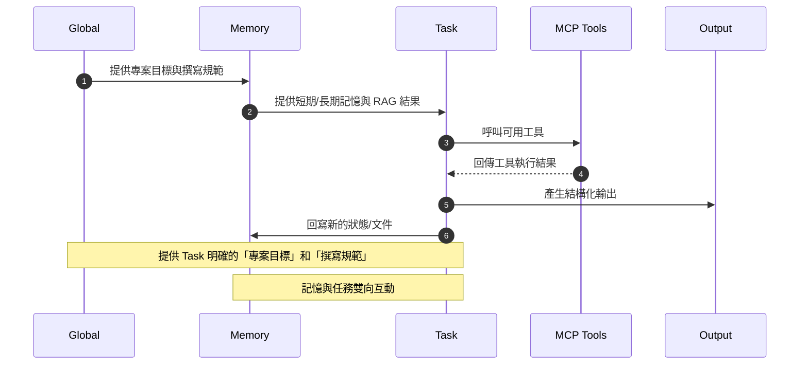

# 介紹

# 情境工程（Context Engineering）

> 如果你什麼資訊都不提供，你怎麼能期待 AI 產出你想要的東西？但，到底要提供什麼資訊同時又要避免爲了提供足夠的資訊反而造成開發上的負擔呢？

提示工程（Prompt Engineering）這個專有名詞的目的在於不修改模型參數的情況下，透過設計合適的提示，引導模型產生更符合預期的結果。

而情境工程（Context Engineering）則是進一步擴展這個概念，Prompt 不單單是文字一串文字，而是包含了更多更複雜的交互資訊，並且這些資訊會隨著時間不斷更新，讓模型能夠隨時取得最新的資訊來產生更符合需求的結果。

在 Philipp Schmid 的文章 [The New Skill in AI is Not Prompting, It's Context Engineering](https://www.philschmid.de/context-engineering) 中，他使用了下圖來描述情境工程所包含的元素：

筆者認爲這張圖已經很清楚地說明了情境工程中所包含的元素有哪些，但還可以更進一步地說明這些元素之間的互動關係，因此筆者將上述的元素稍作修改（同類型的元素合併），並且使用循序圖來說明這些元素之間的互動關係，如下圖所示：

此圖需要從中間的 Task 元素開始看起：

1. **任務啟動**：當使用者提出新需求時，會被動接收來自 Global 的專案目標與撰寫規範，這些屬於長期不常變動的全域性資訊
1. **情境補充**：同時會取得 Memory 中的短期／長期記憶與 RAG 結果（文件檔、範例程式等...），這些資訊會隨時間不斷更新
2. **工具調用**：依據任務需求選擇可用的 MCP Tools，以獲取額外的資訊或執行特定操作（執行 CMD）
3. **結果整合**：接收 MCP Tools 回傳的執行結果，並將前面接受到的資訊整合，形成完整的情境
4. **輸出生成**：根據提供的情境以及 Task 產生結構化輸出
5. **狀態回寫**：最後的輸出也會寫回至 Memory，以便後續任務能持續累積與更新知識

# 重點回顧

- Context Engineering 的核心概念？
   - 透過「系統化」地收集開發所需要知道的資訊
   - 在有新任務時，能夠「動態組裝」成新的 prompt,讓 AI 能夠精準理解需求

# 參考資料

- [The New Skill in AI is Not Prompting, It's Context Engineering](https://www.philschmid.de/context-engineering)