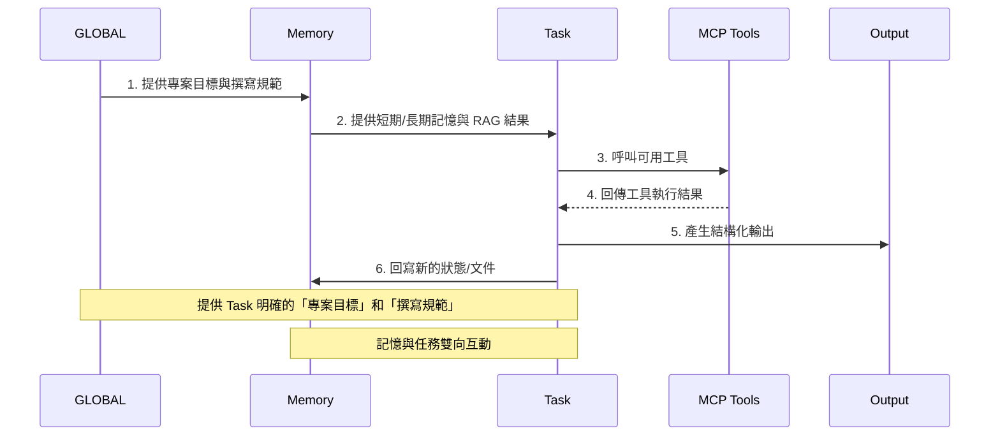

# 介紹

# 情境工程（Context Engineering）

```mermaid
sequenceDiagram
    participant GLOBAL
    participant Memory
    participant Task
    participant MCP_Tools as MCP Tools
    participant Output

    GLOBAL->>Memory: 1. 提供專案目標與撰寫規範
    Memory->>Task: 2. 提供短期/長期記憶與 RAG 結果
    Task->>MCP_Tools: 3. 呼叫可用工具
    MCP_Tools-->>Task: 4. 回傳工具執行結果
    Task->>Output: 5. 產生結構化輸出
    Task->>Memory: 6. 回寫新的狀態/文件

    Note over GLOBAL,Task: 提供 Task 明確的「專案目標」和「撰寫規範」
    Note over Memory,Task: 記憶與任務雙向互動
```

# 回顧

# 參考資料