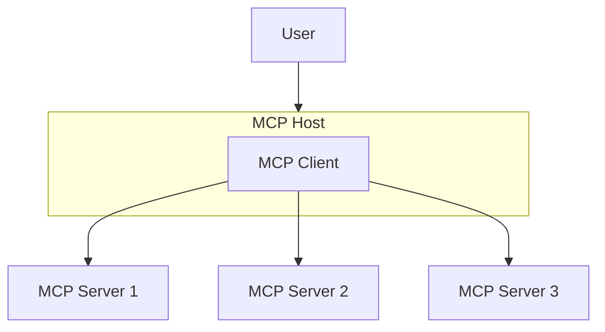

# 介紹

聽過 [Function Calling](https://openai.com/index/function-calling-and-other-api-updates) 嗎？這個名詞是 OpenAI 在 2023 年 6 月提出的新概念，主要是讓 LLM 可以呼叫外部的 function 來取得資料或執行動作。不過這個概念並不是 OpenAI 獨有，其他的 LLM Provider 或是 AI Framework 也都有類似的功能，只是各自的實現方式不同。這也導致開發者在使用不同 LLM 或框架時，需要重新設計 Function Calling 的邏輯。因此，Antropic 就提出了一個新的標準出現，叫做 [Model Context Protocol（MCP）](https://modelcontextprotocol.io/)，故名思義，MCP 的目標是要讓 LLM 可以透過一套統一的方式來呼叫外部工具，以獲取更多的上下文。

> **補充說明**
>
> 在其它領域也有類似 MCP 的概念，如區塊鏈的「預言機」，目的是讓區塊鏈可以與真實世界互動（歷史總是驚人的相似）。

# MCP 基本概念

模型上下文協定（Model Context Protocol，MCP）是一種標準化的格式，用於描述 LLM 可以透過一套統一的方式來呼叫外部的 function 並取得資料或執行動作。

## 基本架構

- MCP Host：AI 的應用程式，像是 GitHub Copilot、Claude 等等
- MCP Client：負責調解 MCP Host 與 MCP Server 之間的溝通
- MCP Server：提供上下文給 MCP Client 的程式

## 傳輸方式

- STDIO：透過 standard input/output 來傳輸資料，適合在本機或容器中運行
- HTTP/SSE：透過 HTTP 或 Server-Sent Events 來傳輸資料，適合在網路環境中運行（支援常見的 HTTP 驗證，包括 Bearer Token、API Key 跟自訂 Header）

# 重點回顧

- 介紹 MCP 短暫的歷史背景
- 理解 MCP 所要解決的問題（透過與外部互動，獲取更多的上下文給 LLM）
- 熟悉 MCP 的基本架構與傳輸方式

# 參考資料

- [Open AI - Function Calling](https://openai.com/index/function-calling-and-other-api-updates)
- [MCP - Architecture overview](https://modelcontextprotocol.io/docs/learn/architecture)
- [區塊鏈預言機介紹](https://academy.binance.com/zh-TC/articles/blockchain-oracles-explained)