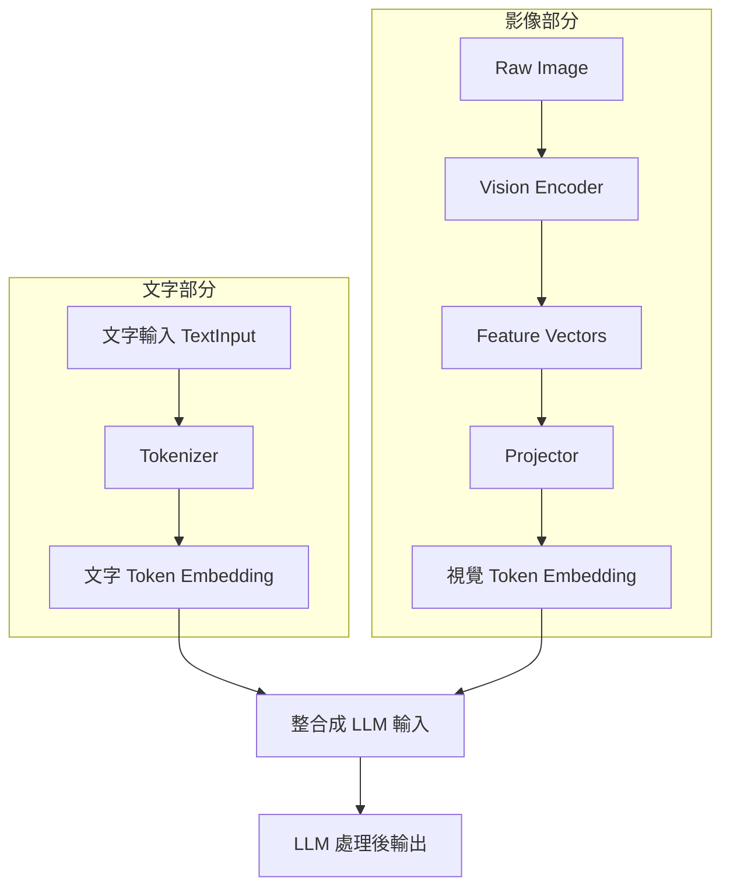

# 介紹

今天要介紹的是透過 VLM 把 PDF 裡面的文字辨識出來後轉換成 Markdown 格式。這次使用的工具是 [dots.ocr](https://github.com/rednote-hilab/dots.ocr)，是由中國的小紅書團隊開發的模型。 

> **補充說明**
>
> 部分公司或組織可能會禁止使用中國開發的軟體，請自行評估風險

# VLM 基礎概念

## VLM 可以用在哪些場景？

- **影像問答（Visual Question Answering，VQA）**：給 VLM 一張圖片 + 一個問題，讓模型分析圖片內容後回答問題。例如「這張照片裡有幾隻貓？」
- **圖片描述（Captions）**：自動生成圖片的文字描述，例如「這是一張有兩隻貓在草地上玩耍的照片」
- **文件理解（Document Understanding）**：分析和理解文件內容（不僅是文字，還包括 Layout、標題、圖表等），並回答相關問題
- **圖形理解（Graph Understanding）**：理解圖形結構（統計圖表）和內容

## 怎麼運作的？

1. **文字部分**：文字先經過處理，把輸入句子拆成一串 tokens。然後這些 tokens 被 embed 成為文字向量（text embeddings）
1. **影像部分**：原始影像會先進入 vision encoder 提取 feature vectors，接著通過 projector 將這些特徵轉換成視覺 token 或向量
1. **整合輸入**：將文字向量和視覺向量整合成一個序列，作為大型語言模型（LLM）的輸入
2. **輸出**：LLM 處理後的輸出會包含文字和影像的相關資訊

# 簡單操作

> 筆電沒有 GPU，使用線上版操作就好 🤐

## 實際操作 dots.ocr

使用線上版的 [dots.ocr](https://dots-ocr.rednote-hilab.com/) 來進行 PDF 轉換

# 其它相關的工具

- [`opendatalab/MinerU`](https://github.com/opendatalab/MinerU)
- [`opendatalab/DocLayout-YOLO`](https://github.com/opendatalab/DocLayout-YOLO)
- [`PyMuPDF`](https://github.com/pymupdf/PyMuPDF)

> **補充說明**
>
> 雖然使用 dots.ocr 或是其他 pdf 轉換工具看起來轉換影像成文字很簡單，但因爲 PDF 內的格式很複雜，像是圖片、表格、雙欄文字等，不是很簡單的 Input 一張圖片就能轉換成想要的格式，會需要針對圖片做 layout 辨識，並且針對不同的區塊做不同的處理，不過這就太複雜了

# 重點回顧

- 簡單介紹 VLM 的概念以及可以應用在哪些場景
- 介紹 VLM 的運作原理（透過 Vision Encoder 把圖片轉 Feature Vectors，再轉換成 Token，最後與文字一起輸入 LLM）
- 介紹 dots.ocr 這個工具，並且實際操作把 PDF 轉換成 Markdown 格式

# 參考資料

- [What Are Vision Language Models? How AI Sees & Understands Images](https://youtu.be/lOD_EE96jhM)
- [dots.ocr](https://dots-ocr.rednote-hilab.com/)
- [FastVLM: Efficient Vision Encoding for Vision Language Models](https://machinelearning.apple.com/research/fast-vision-language-models)