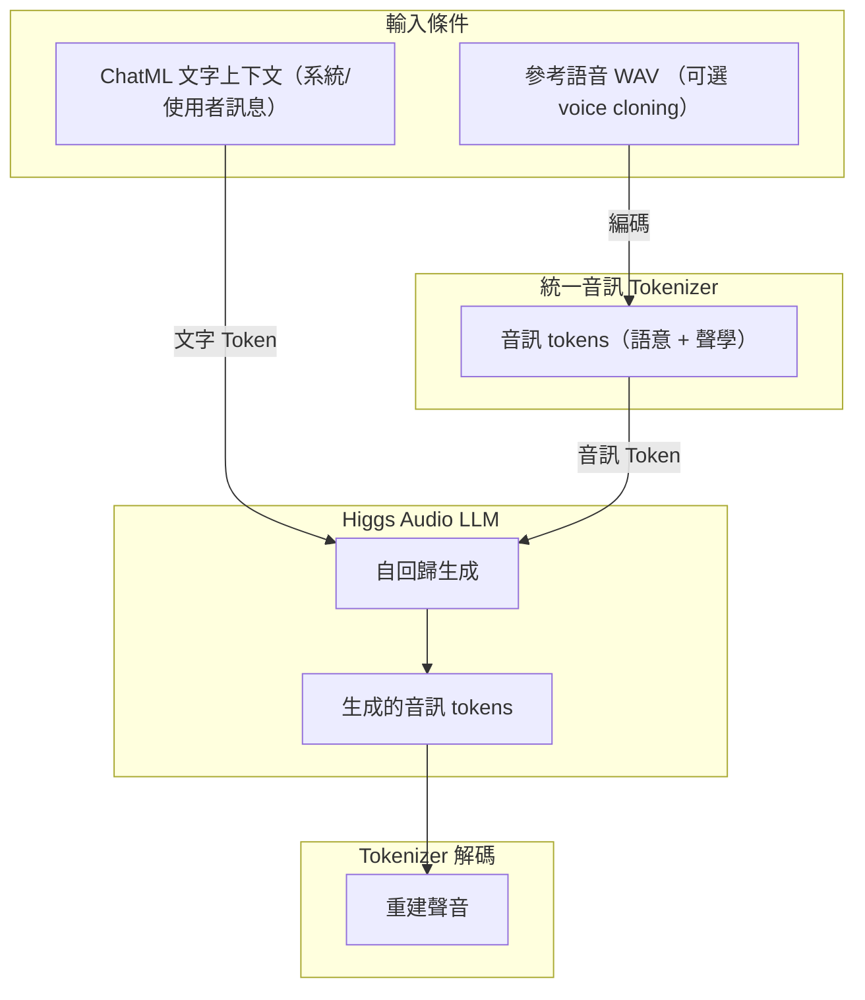

# 介紹

筆者剛好在 YouTube 上看到 [跟李沐学AI - 肝了6个月的AudioLLM，开源了【100亿模型计划】](https://youtu.be/0Dv4s2P65YQ) 的影片，裡面提到 Boson AI 開源了一個叫做 higgs-audio 的 AudioLLM 模型，筆者看了一下 GitHub 的介紹，覺得概念還不錯（不難懂），所以就寫了一篇文章來介紹這個模型背後的運作概念。

# 介紹 Audio LLM

在開始之前，先要有一個基本概念，對於電腦而言，不論是「聲音」或是「文字」對它都是一樣的東西（數字）。如果直接把聲音當作另一個語言來訓練是否可行？

## Higgs-Audio 使用到的工具

Higgs-Audio 使用了許多現成的概念與工具（音訊編解碼、資料處理等），先逐一介紹，後續就會知道這些工具的作用

```text
# requirements.txt
descript-audio-codec
torch
transformers>=4.45.1,<4.47.0
librosa
dacite
boto3==1.35.36
s3fs
torchvision
torchaudio
json_repair
pandas
pydantic
vector_quantize_pytorch
loguru
pydub
ruff==0.12.2
omegaconf
click
langid
jieba
accelerate>=0.26.0
```

### descript-audio-codec

> 將音訊壓縮成低比特率的離散 codes（如約 8 kbps 等），再由 codes 解碼重建音訊波形，輸入音訊可為 44.1/48 kHz 等取樣率

- GitHub：https://github.com/descriptinc/descript-audio-codec
- Paper：https://arxiv.org/abs/2306.06546

### librosa

> 音訊分析的套件，可用來做「[數位訊號處理](https://librosa.org/doc/latest/core.html)」

- GitHub：https://github.com/librosa/librosa
- Documentation：https://librosa.org/doc/latest/index.html

### vector_quantize_pytorch

> 跟文字的 Tokenizer 功能類似，目的是將連續的聲音轉換成離散的 ID
> - 文字 Tokenization：文字 $\rightarrow$ 離散 token ID
> - 語音 Vector Quantization：連續向量 $\rightarrow$ 離散 codebook ID

- GitHub：https://github.com/lucidrains/vector-quantize-pytorch

### pydub

> 處理音訊檔案的工具，可以做切割、拼接、轉換格式、音量調整等等 ...

- GitHub：https://github.com/jiaaro/pydub
- Documentation：https://github.com/jiaaro/pydub/blob/master/API.markdown

### langid

> 文字語言辨識工具，用於判斷文字是哪種語言

- GitHub：https://github.com/saffsd/langid.py

## Audio LLM 背後運作邏輯概念

- 雖然人聲是「連續訊號」，但可用 Tokenizer（像是：`vector_quantize_pytorch`）把連續的聲音轉換成有限離散的 token
- 一旦把聲音表示成離散的 token（跟文字一樣），就能讓「聲音生成」發生在 LLM 內部  
- 最後用對應的 Decoder（像是：`descript-audio-codec`）把生成的音訊 tokens 還原成聲音，模型就能開口說話



> **補充說明**
>
> 上面提到的 `vector_quantize_pytorch`、`descript-audio-codec` 只是幫助理解的工具例子，Higgs-Audio v2 實際上是 Boson AI 自己重新設計和訓練過的模型

# 重點回顧

- 聲音也能當作文字來建模，透過把音訊離散化成 token，讓聲音和文字一樣能進入 LLM 去生成
- 介紹了幾個相關工具（如 `vector_quantize_pytorch`、`descript-audio-codec` 等），幫助理解「連續  離散 → 再生成」的流程
- 雖然列出這些工具做說明，但 Higgs-Audio v2 的 tokenizer、encoder-decoder 與生成模組其實是 Boson AI 自家重新設計並訓練的模型

# 參考資料

- [跟李沐学AI - 肝了6个月的AudioLLM，开源了【100亿模型计划】](https://youtu.be/0Dv4s2P65YQ)
- [boson-ai/higgs-audio](https://github.com/boson-ai/higgs-audio)