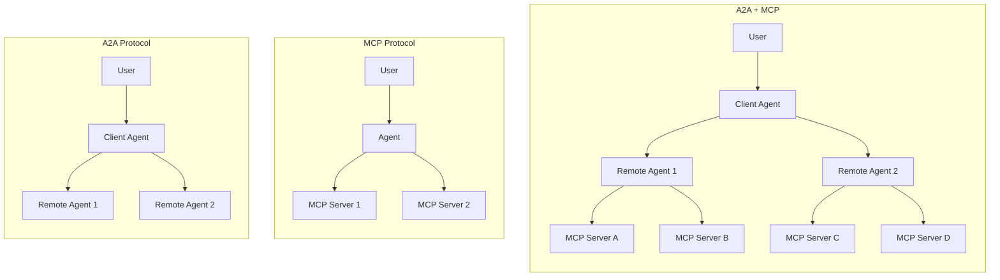

# 介紹

去年底 Antropics 推出了一個叫做 MCP 的 Protocol，讓 LLM 可以透過統一的介面來與外部互動，今年 4 月 Google 也推出了一個新的 Protocol 叫做 [A2A（Agent to Agent）](https://developers.googleblog.com/en/a2a-a-new-era-of-agent-interoperability/)，目的是爲了讓不同 provider 的 Agent 可以透過統一的介面來互相溝通。今天就先簡單蒐集一下 A2A 有關的資源。

# 資料彙整

## A2A 與 MCP 的主要差異

- A2A：LLM 之間的溝通協議
- MCP：LLM 與工具之間的溝通協議

> **補充說明**：
>
> A2A 負責 LLM 之間的協作與任務分工，而 MCP 則讓 LLM 能安全一致地使用外部工具與資料，兩者結合才能讓 LLM 發揮最大效能

## 類似 A2A 的 Protocol

IBM 在今年 3 月時已經推出了一個叫做 [Agent Communication Protocol（ACP）](https://github.com/i-am-bee/acp) 的協議，但是在 8 月份時 ACP 決定加入 A2A 的行列

## 資源

- [A2A Specification](https://a2a-protocol.org/latest/specification/)
- [Python Quickstart Tutorial: Building an A2A Agent](https://a2a-protocol.org/latest/tutorials/python/1-introduction/)
- [a2aproject/a2a-python](https://github.com/a2aproject/a2a-python)

# 重點回顧

# 參考資料

- [ACP Joins Forces with A2A](https://lfaidata.foundation/communityblog/2025/08/29/acp-joins-forces-with-a2a-under-the-linux-foundations-lf-ai-data/)
- [What is A2A?](https://a2a-protocol.org/latest/topics/what-is-a2a/)
- [A2A and MCP: Detailed Comparison](https://a2a-protocol.org/latest/topics/a2a-and-mcp/)