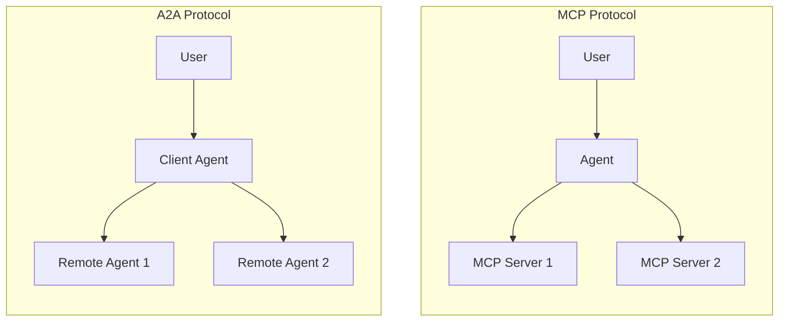
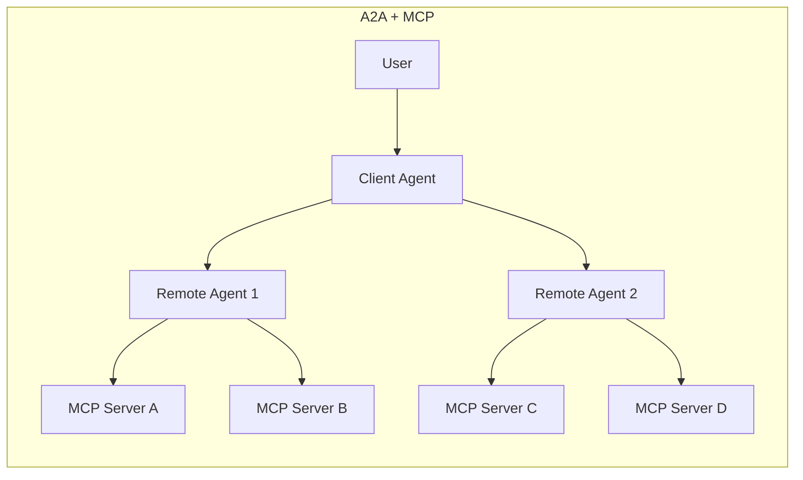

# 【Day22】Agent2Agent（A2A）介紹

## 介紹

去年底 Antropics 推出了一個叫做 MCP 的 Protocol，讓 LLM 可以透過統一的介面來與外部互動，今年 4 月 Google 也推出了一個新的 Protocol 叫做 [A2A（Agent to Agent）](https://developers.googleblog.com/en/a2a-a-new-era-of-agent-interoperability/)，目的是爲了讓不同 provider 的 Agent 可以透過統一的介面來互相溝通。今天就先簡單蒐集一下 A2A 有關的資源。

## 資料彙整

### A2A 與 MCP 的主要差異

- A2A：LLM 之間的溝通協議
- MCP：LLM 與工具之間的溝通協議

> **補充說明**：
>
> A2A 負責 LLM 之間的協作與任務分工，而 MCP 則讓 LLM 能安全一致地使用外部工具與資料，兩者結合才能讓 LLM 發揮最大效能

### 類似 A2A 的 Protocol

IBM 在今年 3 月時已經推出了一個叫做 [Agent Communication Protocol（ACP）](https://github.com/i-am-bee/acp) 的協議，但是在 8 月份時 ACP 決定加入 A2A 的行列

### 資源

- [A2A Specification](https://a2a-protocol.org/latest/specification/)
- [Python Quickstart Tutorial: Building an A2A Agent](https://a2a-protocol.org/latest/tutorials/python/1-introduction/)
- [a2aproject/a2a-python](https://github.com/a2aproject/a2a-python)

### A2A Specification 怎麼看？

在 A2A Specification 裡面會看到幾個常見的關鍵字：

- **MUST**：絕對要求
- **MUST NOT**：絕對禁止
- **SHOULD**：建議／推薦（在大多數情況應該做，但在某些特定情況下可以不做）
- **SHOULD NOT**：建議不要做
- **MAY**：可選（規格允許，但並不強制）

#### 章節規劃

1. **Introduction**：說明 A2A 的定位與動機，定義要解決的問題（不同 provider 的 LLM 都能互相溝通）
2. **Core Concepts**： 定義 A2A 的基本概念與術語（Client/Server、Agent Card、Message/Part 等等）
3. **Transport/Formats**：支援的傳輸協議與資料格式（JSON-RPC/gRPC、REST 等等）
4. **Authentication and Authorization**：認證與授權機制
5. **Agent Discovery**：規範 Agent Card 的結構與內容
6. **Protocol Data Objects**：資料結構
7. **Protocol RPC Methods**：規範所有 RPC 方法的界面與行爲
8. **Error Handling**：錯誤處理機制
9. **Common Workflows & Examples**：常見範例（同步、多輪輸入、通知等等）
10. **Appendices**：補充說明
11. **A2A Compliance Requirements**：說明合規要求

## 重點回顧

- 快速瞭解 A2A 以及 MCP 的差異
- 瞭解 A2A 的資源與規範的整體架構

## 參考資料

- [ACP Joins Forces with A2A](https://lfaidata.foundation/communityblog/2025/08/29/acp-joins-forces-with-a2a-under-the-linux-foundations-lf-ai-data/)
- [What is A2A?](https://a2a-protocol.org/latest/topics/what-is-a2a/)
- [A2A and MCP: Detailed Comparison](https://a2a-protocol.org/latest/topics/a2a-and-mcp/)
- [Key words for use in RFCs to Indicate Requirement Levels](https://datatracker.ietf.org/doc/html/rfc2119)