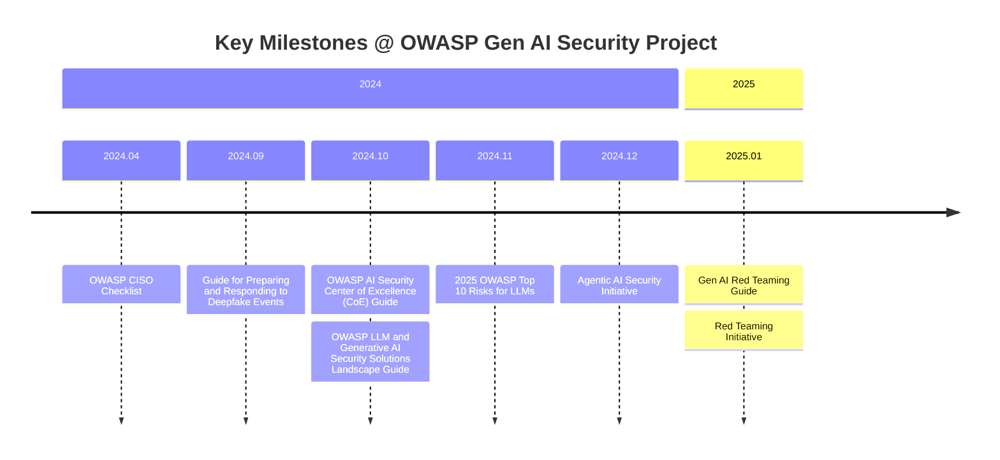

# 介紹

# OWASP Gen AI Security Project 的歷史

# 重點回顧

# 參考資料

- [OWASP Gen AI Security Project Introduction and Background](https://genai.owasp.org/introduction-genai-security-project/)
- [OWASP Top 10 for Large Language Model Applications](https://owasp.org/www-project-top-10-for-large-language-model-applications/)
- [OWASP GenAI Security Project](https://genai.owasp.org/)
- [Thread#資訊安全](https://www.threads.com/@vlab_ict/post/DN1xlGs5Njb)
