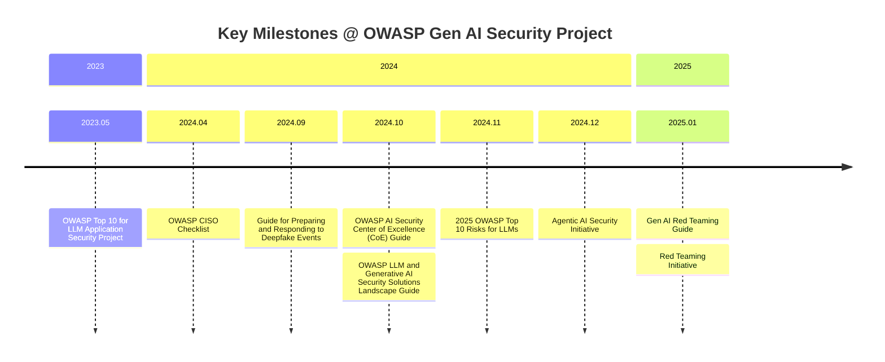

# 介紹

終於來到這一天了，前面的文章都著重在介紹如何使用 AI、開發 AI 應用，今天要來談的主題是筆者一直想瞭解卻又一直沒有深入研究的 AI 安全議題。

隨著 AI 技術的快速發展，越來越多人使用 AI 工具來協助工作，企業也開始將 AI 技術整合到他們的產品和服務中。然而，與其它技術一樣，引進 AI 的過程中也要思考背後可能會遇到的安全風險。

以下兩個案例是筆者在過去幾個月中看到的一些討論，第一個案例是關於北捷的 AI 應用沒有針對使用者的輸入進行適當的過濾，導致使用者可以隨意問一些與捷運無關的問題；第二個案例是未來的惡意軟體不一定要先把惡意程式碼寫好，相反的，這些惡意程式碼可以透過 AI 來即時生成，那麼這些惡意程式碼要如何被偵測？這些案例都顯示了 AI 技術在應用過程中可能會遇到的安全挑戰。

# OWASP Gen AI Security Project 的歷史

從上面的案例可以看出，AI 技術的安全性已經成為一個非常重要的議題。OWASP（Open Web Application Security Project）是一個致力於提升軟體安全的非營利組織。以下整理 OWASP Gen AI Security Project 的發展歷程與未來方向：

### 時間軸

- **2023 年**：推出首份風險清單「OWASP Top 10 for LLM Application Security Project」
- **2024 年**：快速擴展，推出多個指南和工具，包括 CISO 清單、Deepfake 應對指南、CoE 指南、解決方案概覽，並更新 2025 LLM Top 10
- **2025 年**：進一步深化安全測試，推出 Gen AI Red Teaming Guide 和 Red Teaming Initiative（倡議）

### 研究與解決方案

- **AI Threat Intelligence & Red Teaming**：AI 滲透測試方法與紅隊演練流程
- **Secure AI Adoption Frameworks**：提供企業指引，協助安全地部署與維護 AI 應用
- **Agentic AI Security**：代理型 AI 的安全
- **AI Security Solutions Landscape**：AI 安全解決方案概覽
- **Securing and Scrutinizing LLMs in Exploit Generation**：評估 LLM 生成攻擊程式的風險，並驗證現有偵測機制

# 重點回顧

- 提供 2 個實際案例，說明 AI 技術在應用過程中可能會遇到的安全挑戰
- 介紹 OWASP Gen AI Security Project 的歷史與未來方向

# 參考資料

- [OWASP Gen AI Security Project Introduction and Background](https://genai.owasp.org/introduction-genai-security-project/)
- [OWASP Top 10 for Large Language Model Applications](https://owasp.org/www-project-top-10-for-large-language-model-applications/)
- [OWASP GenAI Security Project](https://genai.owasp.org/)
- [Thread#資訊安全](https://www.threads.com/@vlab_ict/post/DN1xlGs5Njb)
